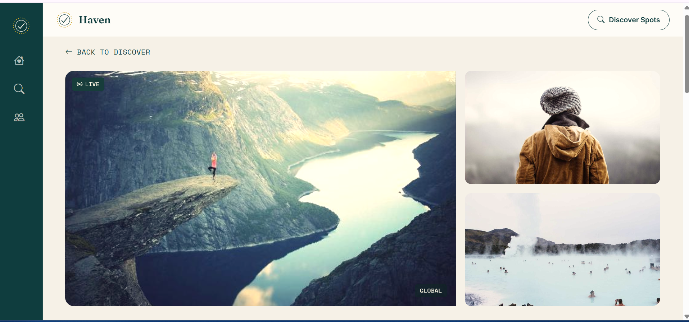
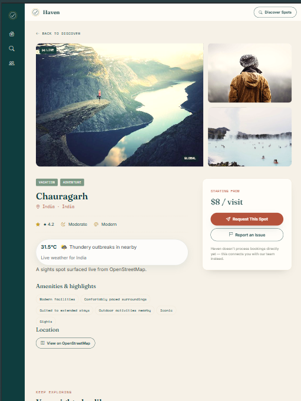
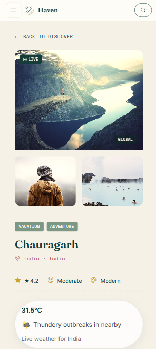

# Haven — Find the Place for Your Moment

A spot-finder web app for weddings, honeymoons, and vacations — a curated local (Lebanon) and global collection, plus live points-of-interest search for anywhere else in the world.

**Author:** Marc Aboudib
**Course:** Full Stack Development — Final Project
**Institution:** Lebanese University, Faculty of Engineering, Branch 2

---

## Live Demo & Repository

- **Live URL:** https://breakin679.github.io/Haven/
- **Repository:** (https://github.com/Breakin679/Haven.git)

---

## Description

Haven helps people find a venue for a specific moment — a wedding, a honeymoon, a weekend getaway — instead of scrolling generic listings. It's built around two data sources shown side by side in one interface:

- **18 hand-curated spots** (10 in Lebanon, 8 international) with real fields: price, rating, serenity, atmosphere, and tags — not placeholder text.
- **Live points of interest for any city on Earth**, fetched on demand and merged directly into the same results grid, same filters, same sort.

The site is four pages: a home page with an auto-rotating showcase and testimonials, a Discovery Engine with search/filter/sort, a dynamic spot-details page, and a Community page for venue submissions and contact/FAQ.

## Features

- Collapsible sidebar navigation 
- Home page hero, animated stats, infinite auto-rotating carousels (spots + testimonials)
- Discovery Engine: free-text search, Local/Global toggle, sort modes, and an expandable "More Filters" panel (type, price range, rating, serenity, atmosphere, interests, location) — all generated from the actual data, not hardcoded
- Live API search merged directly into the results grid, with loading/error/empty states
- Dynamic spot-details page (image gallery, amenities, pricing, related spots) driven entirely by a `?id=` query param
- Venue submission form and contact form with full client-side validation, plus an FAQ accordion
- Fully responsive: hover-expand sidebar on desktop, tap-to-open hamburger on tablet/mobile
- Written in **plain HTML5, hand-written CSS3, and vanilla ES6 — no frameworks, no build step**

## API Used

**Nominatim (geocoding) + Overpass API (points of interest)** — both from OpenStreetMap, free and keyless.

- `Nominatim` turns a typed city name into coordinates and a bounding box.
- `Overpass` is then queried for nearby `tourism`, `historic`, `leisure`, and `natural` nodes within a radius derived from that bounding box , this radius was originally a bug).
- `WeatherAPI (Key-Authorized)` Securely integrated using token `a5825edd997845d4960190952260507` to render live structural weather blocks for selected destination profiles with intelligent geographic fallback resolution.


## Custom Requirement

**Personal requirement: a collapsible sidebar with icons and labels.**

- **Desktop (≥1025px):** a slim 76px icon rail that expands to show labels on hover — no click required.
- **Tablet/mobile (≤1024px):** hover isn't reliable at this size, so the rail instead opens via a hamburger button (`☰`) that morphs into an `✕` when expanded, positioned at the top of the sidebar. (but the ipad pro in the screenshot is bigger while the mobile shows the hamburger button.)
- The active page is always highlighted, computed client-side from `window.location.pathname`.

## Project Structure

```
Haven-main/
├── index.html            Home page
├── search.html           Discovery Engine
├── details.html          Spot profile page
├── community.html        Submission + contact + FAQ
├── css/
│   └── style.css         Entire design system (one file, hand-written)
├── js/
│   ├── sidebar.js         Collapsible sidebar (Sidebar class)
│   ├── carousel.js        Generic infinite carousel engine (Carousel class)
│   ├── destinations.js    Spot data model + curated dataset (Destination, LiveSpot, DestinationCatalog)
│   ├── search.js          Discovery Engine filters/sort/pagination (SpotBrowser class)
│   ├── api.js             Nominatim + Overpass client (LiveSpotClient class)
│   ├── details.js         Spot-details rendering (DetailsPage class)
│   ├── community.js       Form validation/submission (SubmittableForm, VenueSubmissionForm)
│   ├── hero.js             Animated stat counters (CountUp class)
│   ├── testimonials.js    Testimonial carousel content
│   └── backtotop.js       Scroll-to-top button
└── screenshots/          Evidence screenshots (mobile / desktop)
```

## Running It Locally

No build step, no dependencies. Either:

1. Open `index.html` or use live server for to use the api directly in a browser


## Screenshots

### Desktop Layout (Laptop View)


### Tablet Layout


### Mobile Layout — Responsive Drawer / Mobile Details View

---

## AI-Use Appendix

Per the assignment's disclosure requirement, this section is honest about what each tool did and where it got things wrong.

### Tools Used

Tool
What it was used for

**Claude** (this conversation)
Primary development partner — architecture, all HTML/CSS/JS, iterative design and bug fixes, this README
Claude chat link: https://claude.ai/share/f7a4275b-956f-4851-9464-df75b454c4e6

**Cursor**
Technical last-resort help: line-level code review that caught bugs Claude's own testing had missed (see below)

**Gemini**
Small clarifying questions during development (no code generation kept from it, so no prompts logged here)

### Example Prompts Used

**Claude — initial project kickoff:**

> "I sent you course material and a pdf which has requirements that are very important to follow for this FullStack Project... The project we will be doing is a spot finder for vacations, weddings.... To keep things perfectly organized and clean, the core pages are the following: 1. `index.html`... 2. `search.html`... 3. `details.html`... 4. `community.html`... First let's start with the Home page"

**Claude — mid-project data model overhaul:**


> "I want the following fixes: ... For filters i need... Price (actual prices not high-moderate-...), Type (wedding, Vacation, honeymoon, Couples, adventure, Camping...) it can be multiple ones, Location, Serenity, Atmosphere... Feel free to remake the whole search page if you think its necessary. For API look into these and choose the best one for the filters i gave: Amadeus Self-Service API or the ones presented in the project description. And if you find a better online and free one choose it"

**Cursor — technical review that fed back into the Claude conversation:**

> "Project is already done, we need to fix and improve the design of the whole website especially its resposivness and mobile interface. Its very important to follow these requirements:
Use a collapsible sidebar with icons and labels"

### What the AI Got Wrong (and how it was found/fixed)

1. **Searching a country ("India") returned zero live results.**
The Overpass query used a hardcoded 3km search radius around whatever coordinates Nominatim returned. That's fine for a city, but Nominatim geocodes a whole country to a single centroid point — a 3km circle around India's geometric center lands in a rural area with nothing tagged in OpenStreetMap, so the search silently returned nothing and looked broken. **Found by:** testing a country-level search instead of just cities. **Fixed by:** computing the search radius from Nominatim's returned bounding box instead of a fixed number, clamped between 3km and 25km — verified afterward that a city-sized bounding box still gets a tight ~4.6km radius while a country-sized one correctly gets the full 25km.
2. **Adding a live spot to the search results appeared to do nothing.**
Live spots (from the API) don't have a rating, and the default "Best Match" sort tie-broke by rating with `null` treated as `0` — so every freshly-added live spot silently sorted to the very bottom of the list, below all 18 rated curated spots. Clicking "Add to Results" looked like it failed even though the data had, in fact, been added. **Found by:** deliberately testing the count-before/count-after and checking how many "Live" badges were actually visible on screen, not just trusting the success message. **Fixed by:** guarding all null price/rating comparisons in the sort logic and giving freshly-added live spots a small relevance bonus so they surface immediately instead of needing "Load More" clicks to ever be seen.
3. **A spot's data vanished the moment you clicked into its details page.**
`destinations.js` runs on every page and unconditionally saved the curated 18-spot list to `sessionStorage` on load — including on `details.html` itself, which has no carousel. That overwrite wiped out any live spots a search had just added to the session, a split second before `details.js` tried to read them, so live spots opened as "not found" 100% of the time. **Found by:** end-to-end testing the actual click path (search → add live spot → click it) instead of testing the details page in isolation. **Fixed by:** scoping that `sessionStorage` write to only happen on pages that actually render the carousel.
4. **The Overpass query as originally drafted was vulnerable to a `400 Bad Request`.**
Coordinates from Nominatim are returned as strings and were being interpolated directly into the Overpass query template. Cursor's review (quoted above) flagged that unparsed or oddly-formatted coordinate strings could produce an invalid query. **Fixed by:** explicitly coercing both values with `parseFloat()` before building the query, and throwing a clear error if either comes back `NaN` instead of silently sending a malformed request.
5. **Mobile filter arrows and the mobile sidebar were invisible, for two unrelated reasons.**
An earlier iteration added `display: none` on carousel arrows below 640px (meant for a different purpose) and accidentally hid them on phones entirely; separately, the mobile sidebar's dark background blended into an equally-dark footer section behind it, so it was technically rendering but impossible to see. **Found by:** rendering the actual pages in a headless browser at phone width and inspecting computed styles, rather than assuming the CSS was correct. **Fixed by:** removing the stray `display: none` rule and giving the mobile sidebar a color/border treatment that contrasts against both light and dark sections.
